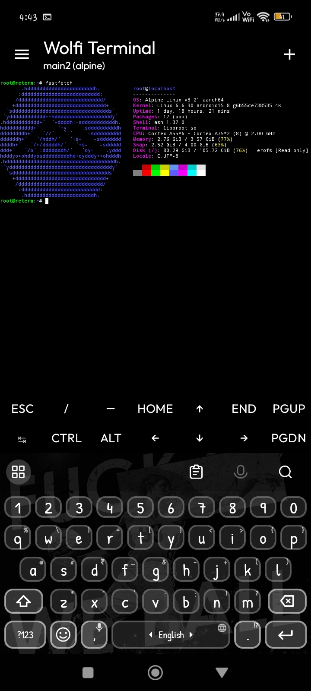
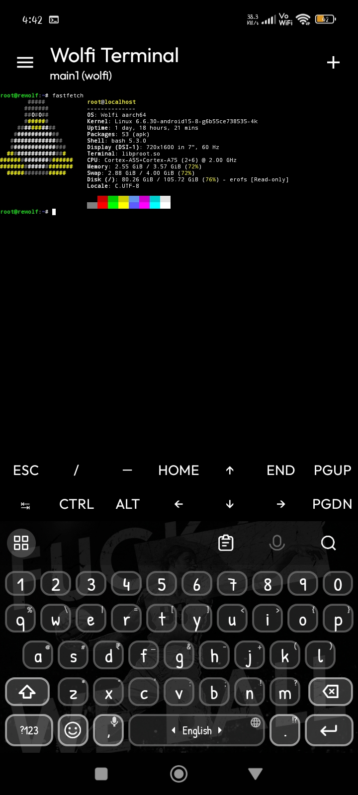
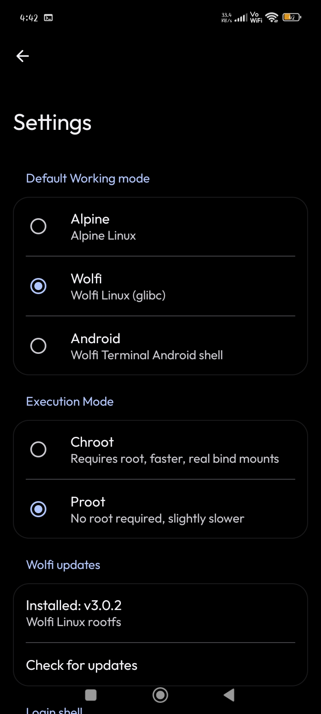
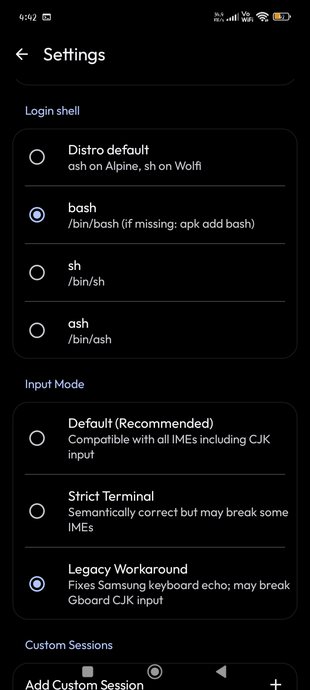

# Wolfi Terminal

**Wolfi Terminal** is a sleek, Material 3 Android terminal emulator with **Wolfi Linux** and **Alpine Linux** built in — no root required. Multiple sessions, virtual keys, proot or chroot execution, and a configurable login shell. Built on [Termux's](https://github.com/termux/termux-app) TerminalView. Forked from [ReTerminal](https://github.com/RohitKushvaha01/ReTerminal).

## Download

Get the latest APK from the [Releases page](https://github.com/leloush-x/wolfi-terminal/releases/latest) — a single rolling release, always the newest build (`wolfi-terminal-latest.apk`).

Direct download: https://github.com/leloush-x/wolfi-terminal/releases/latest/download/wolfi-terminal-latest.apk

## Distros

| Distro | Base | Install |
|--------|------|---------|
| 🐺 Wolfi | glibc, `apk`, with `fastfetch`, `curl`, and `git` preinstalled | On-demand download from [wolfi-os-rootfs](https://github.com/leloush-x/wolfi-os-rootfs) (Settings → Default Working mode → Wolfi) |
| 🏔️ Alpine | musl, bundled in the APK | Automatic on first launch |
| 🤖 Android | Host shell | Built in |

> **Note:** Wolfi requires arm64 or x86_64. On 32-bit ARM devices, use Alpine.

## Features

- Terminal with Material 3 UI
- Virtual keys bar (customizable via JSON)
- Multiple sessions (Alpine / Wolfi / Android / custom)
- Wolfi Linux support (glibc, on-demand latest rootfs)
- Alpine Linux support (bundled)
- proot (no root needed) or chroot (rooted, faster) modes
- bash default login shell (configurable: sh / ash, with per-distro fallback)
- Configurable keyboard shortcuts (paste, session management)
- Direct script launch (open `.sh` files with the terminal)
- Custom fonts, background images, themes, and dynamic Monet colors

## Screenshots

<div>
  
  
</div>
<div>
  
  
</div>

## Build

```sh
./gradlew assembleRelease
# APK: app/build/outputs/apk/release/
```

CI builds and publishes to the rolling `latest` release on every push to `main` (or manual trigger).

## Credits

- [ReTerminal](https://github.com/RohitKushvaha01/ReTerminal) — base app
- [Wolfi](https://github.com/leloush-x) via [wolfi-os-rootfs](https://github.com/leloush-x/wolfi-os-rootfs) — Wolfi rootfs builds
- [Termux](https://github.com/termux/termux-app) — TerminalView / Terminal Emulator

## License

MIT — see [LICENSE](LICENSE).
