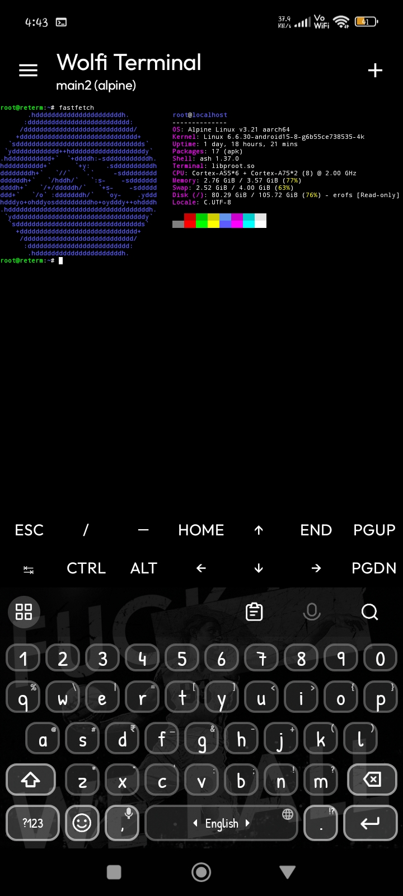
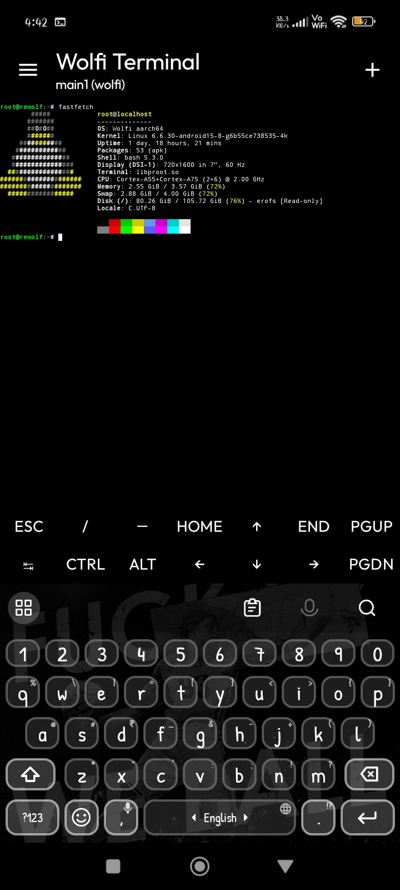
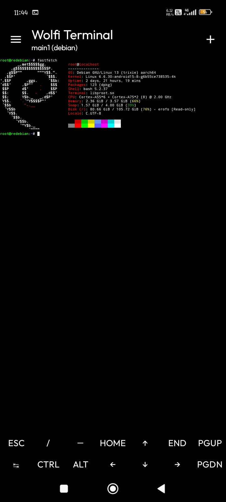
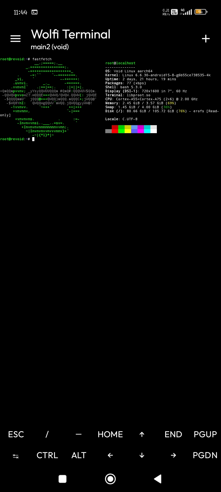

# Wolfi Terminal

A fast Material 3 terminal for Android with real Linux inside — Wolfi, Alpine, Debian, and Void, plus your Android shell. No root required.

[](https://github.com/leloush-x/wolfi-terminal/releases/latest)
[](https://github.com/leloush-x/wolfi-terminal/actions/workflows/android.yml)
[](LICENSE)

Wolfi Terminal is an Android terminal emulator built on [Termux's TerminalView](https://github.com/termux/termux-app). It started as a fork of [ReTerminal](https://github.com/RohitKushvaha01/ReTerminal) and grew into its own thing: pick a distro on first launch, get a working shell in seconds, open more sessions when you need them, and tweak the look and keys until it feels like yours.

If you just want to SSH, run git, use python/node, or carry a small Linux box in your pocket — install the APK and go. Root is optional and only matters for one execution mode.

## Screenshots

<div>
  
  
</div>
<div>
  
  
</div>

## Download

One rolling release, always the newest build from `main`:

- **Releases page:** https://github.com/leloush-x/wolfi-terminal/releases/latest
- **Direct APK:** https://github.com/leloush-x/wolfi-terminal/releases/latest/download/wolfi-terminal-latest.apk

Install it like any APK (allow install from your browser / file manager once). Current line is v1.3.0. Requires Android 8.0+ (API 26). Upgrading keeps your sessions, settings, and distro files.

Every push to `main` runs unit tests, builds a release APK, and — only if both pass — overwrites that same `latest` release. So what you download is always tested.

## Distros

| Distro | Base / package manager | How you get it | Prompt |
|--------|------------------------|----------------|--------|
| Wolfi | glibc, `apk` — ships with `curl`, `git`, `fastfetch` | On-demand download, picked on first launch or from Settings | `root@rewolf` |
| Alpine | musl, `apk` — small and quick | Bundled in the APK, set up automatically | `root@reterm` |
| Debian | glibc, `apt` | On-demand download from Settings | `root@redebian` |
| Void | glibc, `xbps` | On-demand download from Settings | `root@revoid` |
| Android | Your phone's own shell | Built in, nothing to install | host prompt |

Wolfi, Debian, and Void rootfs builds come from [wolfi-os-rootfs](https://github.com/leloush-x/wolfi-os-rootfs) and are fetched as `<distro>-rootfs-aarch64.tar.gz` / `<distro>-rootfs-x86_64.tar.gz` for the newest GitHub release. The app picks the right one for your device.

> 32-bit ARM? Stick with Alpine. Wolfi / Debian / Void only ship arm64 and x86_64 builds.

## Quick start

1. Install the APK and open Wolfi Terminal.
2. On first launch, pick a distro. Alpine is instant. Wolfi / Debian / Void download once (a minute or two on decent wifi) and then just work.
3. Use the `+` button for more sessions. Each tab shows what it is, e.g. `main(wolfi)`, `main(debian)`.
4. Open Settings when you want to change the default distro, execution mode, login shell, theme, keys, or shortcuts.

Switching distros later: **Settings → Default Working Mode**, or long-press / session menu to open a specific one. Updating a distro: **Settings → Wolfi / Debian / Void Linux rootfs → check for update**. After an update, restart that distro's sessions.

## What you get

**Terminal that behaves.** Multiple live sessions, proper `TERM=xterm-256color` handling, foreground service so sessions survive when you switch apps, configurable font size, bell, and text colors.

**Five ways to run.** Alpine, Wolfi, Debian, Void, and Android host, each with its own home directory that sticks around between updates. Custom sessions too — give a name and a shell path and pin one as default.

**proot by default, chroot when you want speed.** proot needs no root and works everywhere. chroot is faster but needs root. There is also a Chroot (Shevery) mode that borrows root from a manager app — covered below.

**Login shell you control.** Defaults to `/bin/bash`, falls back per distro if bash is missing (`apt update && apt install -y bash` on Debian, `xbps-install -S bash` on Void). Your prompt is branded per distro and survives `/etc/bash.bashrc` and `~/.bashrc` overrides.

**Keys and shortcuts for a phone keyboard.** An extra keys row on top of the system keyboard, editable as JSON. Plus remappable hardware-keyboard shortcuts for paste, new/close session, and prev/next session.

**Make it yours.** System-following dark/light theme, AMOLED black, Monet dynamic colors on Android 12+, a set of built-in accent palettes (Catppuccin default), custom TTF font, background image with blur, and per-session background dimming.

**GitHub built in.** Sign in with a username + token (stored locally) to list your repos, or just paste any repo URL — no sign-in needed. One tap clones straight into the live session, or copies the `git clone` command if no session is open.

**Runs scripts.** Tap a `.sh` file in a file manager and open it with Wolfi Terminal to execute it in your default session.

**Sensible security bits.** Optional seccomp filter toggle if you need it for proot on strict kernels.

## Execution modes

Found under **Settings → Execution Mode**:

| Mode | What it does | Needs root? |
|------|--------------|-------------|
| proot | User-space isolation. Works on any device. | No |
| chroot | Real chroot + bind mounts. Noticeably snappier file access. | Yes (local `su`) |
| Chroot (Shevery) | Same as chroot, but root comes from Shevery/Shizuku via `rish` instead of `su`. | Manager running as root |

If you pick a chroot mode and root is not there, the app does not fail the session — it falls back to what works and tells you why. That rule is deliberate: root problems should never leave you with no terminal.

## Root access with Shevery / Shizuku

The app talks the Shizuku client API, so it works with [Shevery](https://github.com/HmnDev-Tech/shevery) (preferred, package `com.hamondev.shevery`), [Shizuku](https://github.com/RikkaApps/Shizuku), and Sui without extra code.

1. Install and start your manager — root start, wireless debugging, or ADB, whatever you normally use.
2. In Shevery, turn on **“Use in terminal apps”** so this app gets a `rish` binary.
3. In Wolfi Terminal, go to **Settings → Root access** and grant the permission. The status line tells you the truth: root daemon is `uid 0`, ADB-only daemon is `uid 2000`.
4. Choose **Chroot (Shevery)** for distro sessions with bind mounts, or enable **Auto Login** to get an elevated Android shell over `rish`.

Two things people trip on:

- Mount/chroot needs `uid 0`. An ADB-mode daemon (`uid 2000`) cannot mount, so you get a clear fallback message instead of a cryptic failure.
- Missing `rish`, missing grant, missing `su`? Sessions still start, just unelevated.

If you file a root bug, say which manager you use, what uid it reports, and which execution mode was selected. That is usually enough to tell what happened.

## Customization and settings tour

- **Appearance:** follow-system / light / dark, AMOLED, Monet on Android 12+, accent palette picker.
- **Terminal:** font size, custom `.ttf`, background image + blur, extra keys editor, shortcut remapping.
- **Sessions:** default distro or default custom session, custom session manager, login shell path.
- **Distro updates:** per-distro version row with “check for update”, download progress, and restart reminder.
- **Storage:** full-storage permission prompt (needed for `/sdcard` access) with an option to dismiss it if you know what you are doing.

Window and session labels always show the mode — `main(alpine)`, `main(wolfi)`, `main(debian)`, `main(void)`, `main(android)` — so you know which box you are typing in.

## FAQ

**Do I need root?** No. proot + Alpine works out of the box. Root only buys you chroot speed and full bind mounts.

**Which distro should I pick?** Alpine if you want tiny and fast. Wolfi if you want a modern glibc base with fresh packages. Debian if you want `apt` and the biggest package archive. Void if you like `xbps` and a clean, minimal base. You can install all of them and switch per session.

**Why did my Debian/Void prompt say `root@localhost` once?** Old init scripts let the distro's bashrc overwrite the branded prompt. Current builds re-assert `root@redebian` / `root@revoid` after all rc files load (bash gets a wrapper rcfile, plain sh gets a simple prompt). If you still see the old one, update that distro from Settings and restart its sessions.

**Downloads failing?** Check data/wifi, then retry — the downloader resumes cleanly. Rootfs URLs come from the GitHub API for `leloush-x/wolfi-os-rootfs`, so a GitHub outage looks like a “not found” error.

**`.sh` files open in the wrong app?** Set Wolfi Terminal as default for that file type once; Android remembers.

## Build it yourself

You need JDK 17. The Gradle wrapper is in the repo, no separate install.

```sh
./gradlew assembleDebug      # quick local build
./gradlew assembleRelease    # release APK → app/build/outputs/apk/release/
./gradlew testDebugUnitTest  # unit tests (Robolectric, ~49 tests)
```

Local builds sign with the included test key (`app/testkey.keystore`). For your own signing key, drop a `signing.properties` in the repo root (or point `SIGNING_PROPERTIES` at it) with `keyAlias`, `keyPassword`, `storePassword`, and `storeFile`. CI instead decodes `secrets.KEYSTORE` / `secrets.PROP` into `/tmp` — keys never live in the repo.

Project layout:

| Module | What lives there |
|--------|------------------|
| `:app` | Manifest, signing, release wiring |
| `:core:main` | Almost everything — terminal UI, sessions, settings, root, GitHub |
| `:core:components` | Shared Compose pieces |
| `:core:resources` | Strings |
| `:core:proot` | proot native bits |

Dependency versions are pinned in `gradle/libs.versions.toml` (AGP 9.2.1, Kotlin 2.3.20, compileSdk 37).

Want to contribute? Read [CONTRIBUTING.md](CONTRIBUTING.md) — one concern per PR, rebase history, and tests must stay green. Bug reports should include device, Android version, and for root issues the manager + uid + execution mode.

## Credits

- [ReTerminal](https://github.com/RohitKushvaha01/ReTerminal) — the app this forked from
- [wolfi-os-rootfs](https://github.com/leloush-x/wolfi-os-rootfs) — Wolfi / Debian / Void rootfs builds
- [Termux](https://github.com/termux/termux-app) — TerminalView and terminal emulator
- [Shevery](https://github.com/HmnDev-Tech/shevery) / [Shizuku](https://github.com/RikkaApps/Shizuku) — root manager APIs

## License

MIT — see [LICENSE](LICENSE).
